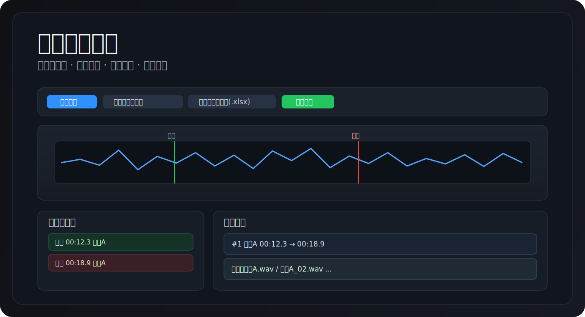

# 音频切片工坊

<p align="center">
  <a href="https://wendellwang194.github.io/audio-marker/"></a>
  <a href="https://github.com/wendellwang194/audio-marker"></a>
  
  
</p>



一个纯前端、免安装的音频切片工具。  
导入音频后，你可以可视化波形、打开始/结束标记、批量导出切片音频，并把切片进度保存为工程表（支持 `xlsx/xls/csv`）下次继续编辑。

## 在线地址

- 在线使用（推荐）：[https://wendellwang194.github.io/audio-marker/](https://wendellwang194.github.io/audio-marker/)
- 仓库地址：[https://github.com/wendellwang194/audio-marker](https://github.com/wendellwang194/audio-marker)

## 30 秒上手

1. 点击 `导入音频`，选择你的音频文件。
2. 播放到目标位置，点 `开始` / `结束` 按钮创建切片区间。
3. 在右侧 `切片列表` 里改切片名（导出的音频名将使用它）。
4. 点击 `导出切片工程表(.xlsx)` 保存进度。
5. 点击 `导出切片` 一次性导出全部切片音频（ZIP）。

## 核心功能

- 波形可视化：支持播放、暂停、点击跳转、拖动进度条。
- 标记切片：每组 `开始 + 结束` 自动形成一个切片。
- 列表联动：标记点列表与切片列表实时同步，支持重命名与时间微调。
- 工程可恢复：导出/导入工程表，支持 `xlsx / xls / csv`。
- 批量导出音频：按切片名导出所有切片，便于后续整理与分发。

## 工程表格式（导入/导出）

导出的工程表包含 3 列，导入时也按同样结构读取：

| 列号 | 字段 | 说明 |
| --- | --- | --- |
| 1 | 开始时间 | 例如 `00:12.3` |
| 2 | 结束时间 | 例如 `00:18.9` |
| 3 | 切片名称 | 例如 `旁白-01` |

支持的时间码：`SS.M`、`MM:SS`、`MM:SS.M`、`HH:MM:SS`、`HH:MM:SS.M`

## 导出说明

- `导出切片工程表(.xlsx)`：优先导出 `xlsx`，极端浏览器环境下自动回退为 `xls`。
- `导出切片`：将所有有效切片打包为一个 ZIP，切片文件名 = 你设置的切片名。
- 为避免浏览器长时间卡住，导出切片会优先走快速 WAV 导出策略。

## 使用流程图


## 本地运行

本项目是单文件前端应用，无需安装依赖：

1. 克隆仓库
2. 直接打开 `index.html`

```bash
git clone https://github.com/wendellwang194/audio-marker.git
cd audio-marker
open index.html
```

## 常见问题

### 1. 导入工程表失败，提示“未读取到有效切片”

请确认：

- 已先导入音频，再导入工程表。
- 文件来自本工具导出的工程表，且为 3 列结构（开始/结束/切片名）。
- 文件格式为 `xlsx`、`xls` 或 `csv`。

### 2. 导出后不知道文件在哪

默认由浏览器下载到系统下载目录（或你浏览器设置的下载目录）。

### 3. 提示 `createWritable ... not allowed by platform`

这是浏览器环境限制（常见于 `file://` 场景或受限 WebView）。  
工具已兼容回退下载策略，建议优先通过在线地址使用：
[https://wendellwang194.github.io/audio-marker/](https://wendellwang194.github.io/audio-marker/)

## 许可证

MIT
